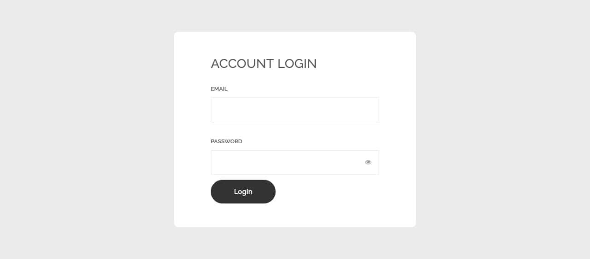
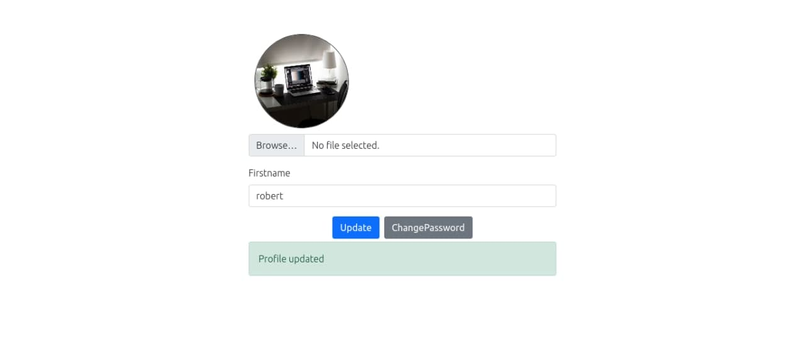
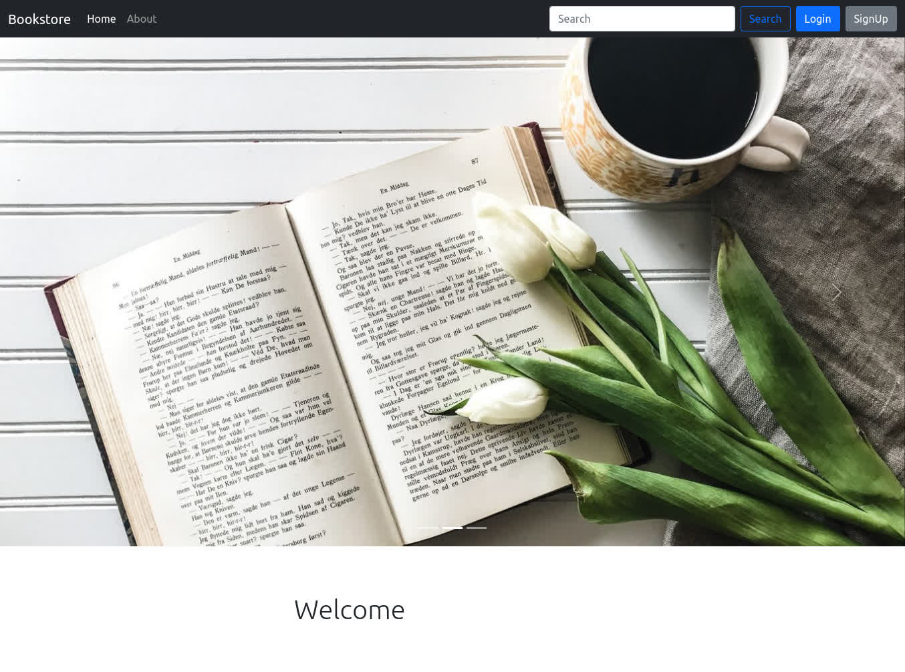

# django-bookstore
<p>
Python3.8 or higher
</p>

##Run

```
git clone https://github.com/m0hammadhossein/django-bookstore.git
cd django-bookstore
python -m virtualenv env
```

<p>active virtual enviroment in linux</p>

```
source env/bin/activate
```

<p>active virtual enviroment in windows</p>

```
env/scripts/activate.bat
```

<p>Then</p>

```
pip install -r requirements.txt
python manage.py makemigrations
python manage.py migrate
```

<p>
Finally, <b>deploy the project on the Apache</b>
</p>

<p float="left">
  
   
  
</p>

